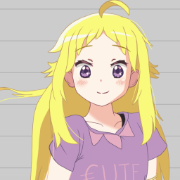

- #[[El Family]] | #[[Circle 🌻 Pia]] | #[[Main Characters]]
- [[Pia]]
  id:: 672a0838-f979-4e01-9f61-255e97aa32ff
	- # Pia Izvari
		- 
		- She may look stupid and always act crazy, but it's actually just a mask she deliberately wears. Pia is insanely smart girl. She can smile to make others happy or suffer.
	- ### Personal
		- Name (English & Indonesia)    : Maharaina Oktavia Rawiya Izvari
		- Nickname                      : Pia
		- Javanese                      : ꦩꦲꦫꦻꦤꦎꦏ꧀ꦠꦮ꦳ꦶꦪꦫꦮꦶꦪꦆꦗ꦳꧀ꦮ꦳ꦫꦶ
		- Japanese Name                 : 怜奈・オクタヴィア イズヴァリ (Reina Oktavia Izvari)
		- Ethicnitiy                    : [[Javanese]]
		- Religion                      : [[Islam]]
		- Hobbies                       : Farming [[El]]'s attention
		- Goals & Dreams                : Conquer the World
	- ### Relative(s)
		- Father                        : [[Iro]](Deceased)
		- Mother                        : [[Itra]](Deceased)
		- Sibling(s):
			- [[EL]] (Brother)
			- [[Aiu]] (Sister)
			- [[Jelly]] (Little Sister)
	- ### [[Circle 🌻 Pia]]
		- [[Pia]] Leader
		- [[Fira]]
		- [[Maria]]
		- [[Tristan]]
		- [[Luna]]
	- ### Physical Characteristcs
	  Age                              : 1X
	  Height                           : 148 cm (4'10")
	- ### Status
	  Occupation                       : Professional Little Sister, [[Student]]
	  School                           : [[62 Junior High School Derana]]
	  Class                            : [[VII-B]]
	- ### Stats
	  ■■■■■■□□□□ 6  Strength
	  ■■■■■■■■■□ 9  Intelligence
	  ■■■■■□□□□□ 5  Good
	  ■■■■■■■■□□ 8  Bad
	  ■■■■■■■■■■ 10 Charisma
	  ■■■■■■■□□□ 7  Wealth
- ## Adittional Information
	- ### Physical Characteristics
	  Gender                           : [[Female]]
	  Weight                           : XX kg
	  Hair Color                       : Golden yellow
	  Eye Color                        : Purple
	- ### Alias(es)
		- Master ([[Fira]])
		- Indonesian
			- Ka Pia ([[Jelly]])
		- Japanese
			- ピア (Pia)
	- ### Relationships
		- Family
			- [[EL]]
			  El is the most important person in Pia's life. Even though she doesn't seem to show it, Pia loves his brother so much. She can't live without him.
			- [[Aiu]]
			  Since childhood, Pia and Aiu have never been very close. They always envy of each other. Despite being so, since Aiu is pencak silat world champion, Pia still treat her with respect.
			- [[Jelly]]
		- Cirlce
			- [[Fira]]
			   
			  After realizing pia's kindness and sincerity. Fira began to admire Pia and start calling her "Master".
			- [[Maria]]
			- [[Sari]]
			- [[Luna]]
		- Good Friends
			- [[Li Na]]
			  Lina and Pia are friend since elementary school.
		- Friends
			- [[1]]
			- [[Donat]]
	- ### Primary Typeface : Ubuntu Sans
	- ### Supporting Typeface : Acherus Grotesque ($), open alternatives DejaVu Sans
- # Appearance
	- asd
- # Personality
	- asd
- # Abilities and Skills
	- ## English
	  Pia speak english fluently
	- ## Superior Intelligence
	  As a child, Pia was small weak and lacked the confidence she now radiates. Little Pia did not really have a friend, she found solace and strength in her learning. At home, she frequently questioned her brother, who, along with their mother, patiently supported her studies.
	  
	  Even though Pia is still in middle school, she is smarter than [[El]] and [[Aiu]] her older siblings.
	- ## Athletic Physical and Strength
	  Pia has a naturally gifted athletic physique. She excels at sports and possesses great endurance and stamina.
- # Background
  Pia born with no tears, she was weak and frail.
  
  Little Pia was quiet child and unsure of herself. a trait entirely absent in her present self.
- # Trivia
	- She called herself "Pia" because, as a child, she couldn't spell her own name. Anyone who spelled it correctly risked her tears and she will get sick.
- # Director Notes
	- Unlike many main character that makes funny of their character by being not able to speak english. Pia do the opposite, she will be funny because she fluently speak english.