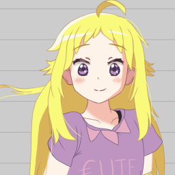

# Uripurup

Uripurup is FREE and open anima project from Indonesia, created by [White Heart](https://github.com/micheliaHEART) and published by [Virtualoka](https://github.com/Virtualoka).

Graphics assets, illustrations, and animations are released under [CC BY 4.0](https://creativecommons.org/licenses/by/4.0/). Unlike traditional animation projects, this free and open anima project allows for study, sharing, and reproduction, even for commercial purposes, as long as you give appropriate credit to White Heart @micheliaHEART.

The series will officialy released in three language. Indonesian, English and Japanese.

Support this project  
[Ko-fi](https://https://ko-fi,com/) link disabled  
[Trakteer](https://https://trakteer,id/) link disabled

# Pia

Name (English & Indonesia): Maharaina Oktavia Rawiya Izvari

Javanese: ꦩꦲꦫꦻꦤꦎꦏ꧀ꦠꦮ꦳ꦶꦪꦫꦮꦶꦪꦆꦗ꦳꧀ꦮ꦳ꦫꦶ

Japanese Name: 怜奈・オクタヴィア イズヴァリ (Reina Oktavia Izvari)  
Height: 148 cm  

She may look stupid and always act crazy, but it's actually just a mask she deliberately wears. Pia is insanely smart girl. She can smile to make others happy or suffer.

# Maria | Gemar

English Name: Maria  
Indonesian: Gemar  
Javanese: ꦒꦼꦩꦂ  
Japanese Name: マリア (Maria)  
Height: 139 cm

Maria is a rich girl. Her mother died when she gave birth to her. Maria's father often chose to sacrifice his job to be with his daughter, he raised Maria his only child with all his heart. She grew up to be a smart and healthy girl. When Maria was in elementary school she often won sports competitions, behind her small body Maria was a strong, brave girl. Even without the love of a mother, Maria  lived happily with her father with abundant wealth and luxury. The world seemed beautiful until on the day of Maria's elementary school graduation, Gemar and her father had a car accident. her father died, while Maria had to sit in a wheelchair shattering all the memories of her as a strong girl.

# Tristan | Sari

English Name: Seraphine Tristanetta Wutheringleighfieldcastleford  
Indonesian: Apsari Tribhuwana Wijayatunggadewi

Javanese: ꦄꦥ꧀ꦱꦫꦶꦠꦿꦶꦧ꧀ꦲꦸꦮꦤꦮꦶꦗꦪꦠꦸꦁꦒꦣꦺꦮꦶ

Japanese Name: 聖子 黒髪姫 空星内親王  (Seiko-no-kurokamihime Sorahoshi Naishinnō)  
Height: 165 cm

One night when she was in 6th grade, Tristan walked through the rice fields in the dark of midnight. She was shocked when the pitch-black place suddenly became full of light. A shining meteor dazzled her view, its light getting brighter and closer. A meteor fell near her. It was unclear what happened, all she remembered was a very bright white light and suddenly she was now floating in the sky. From the high sky, she could see the rice fields that she had been walking through. Since the meteor fell, Tristan has been able to fly at very high speed. She often travels around the world, moving from country to country in a few minutes. Serraphine also began to like photography and immortalize her travels around the world.

# Fira | Ginar

English Name: Fira Morrigan  
Indonesian: Agna Ginaris  
Javanese: ꦄꦒ꧀ꦤꦒꦶꦤꦫꦶꦱ꧀

Japanese Name: 蛍 (Hotaru)  
Height: 133 cm

Fira has quite complicated relationship with her parents. They are bad parents, often abusing her. One day she received cruel treatment from her father, Fira's older brother who could not stand the suffering of his younger sister beat his father until he fainted. For the sake of his sister, He decided to run away from home with her who had just graduated from elementary school. They went to Derana City, Fira's older brother rented a cheap small house and He had to work all day to meet him and her younger sibling's needs, even not infrequently her older brother did not come home for days leaving Fira his younger sibling alone.

# To Do

The writing is poorly machine translated. Rewrite it manually.

# License
Copyright © 2020-2024 [White Heart](https://github.com/micheliaHEART) [@micheliaHEART](https://x.com/micheliaHEART)

Uripurup is licensed under a
[Creative Commons Attribution 4.0 International License][cc-by].

[![CC BY 4.0][cc-by-image]][cc-by]

[cc-by]: http://creativecommons.org/licenses/by/4.0/
[cc-by-image]: https://i.creativecommons.org/l/by/4.0/88x31.png
[cc-by-shield]: https://img.shields.io/badge/License-CC%20BY%204.0-lightgrey.svg
